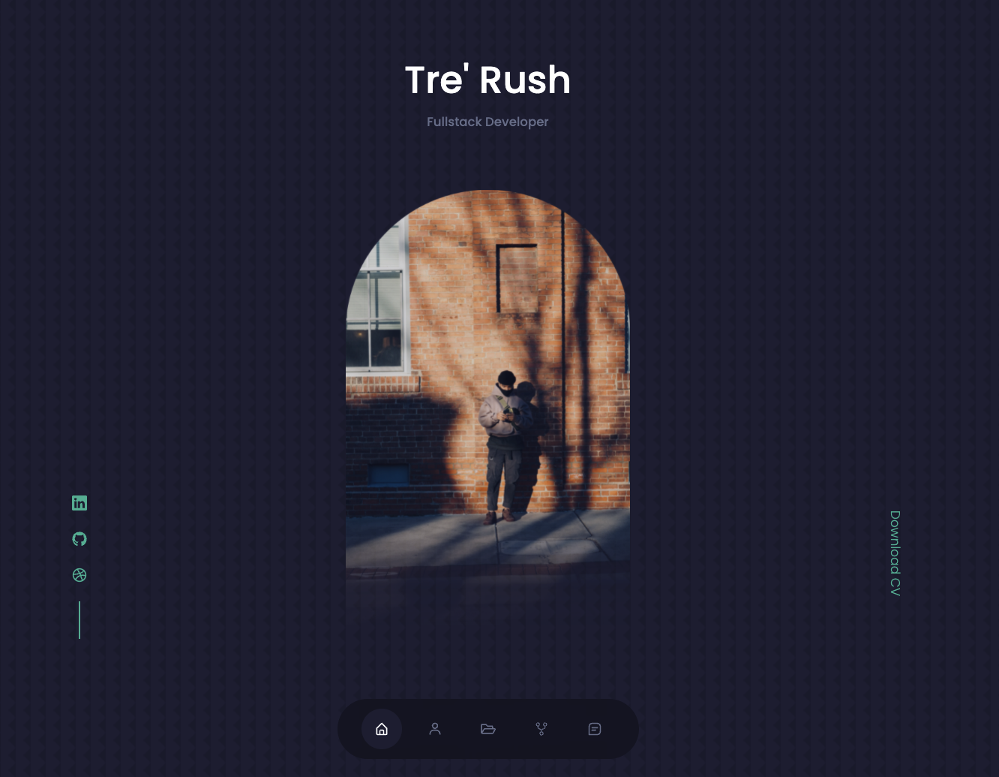

# Portfolio 2.0 

    
    
    

## Description
A personal portfolio application. 

## Table of Contents

- [Description](#description)
- [Installation](#installation)
- [Usage](#usage)
- [License](#license)
- [Contributing](#contributing)

## Installation 

- `git clone` this repository locally. 
- Run `npm init` to install necessary node packages. 
- Run `npx create-react-app` to create your own React application. 

## Usage 

When the application is installed, run `npm start` to launch application locally. 

## Link
https://rush0218.github.io/portfolio-rush-2.0/

## Screenshot

## License

. 

## Contributing

Made with ❤️ by [Tre'](https://github.com/Rush0218) 

